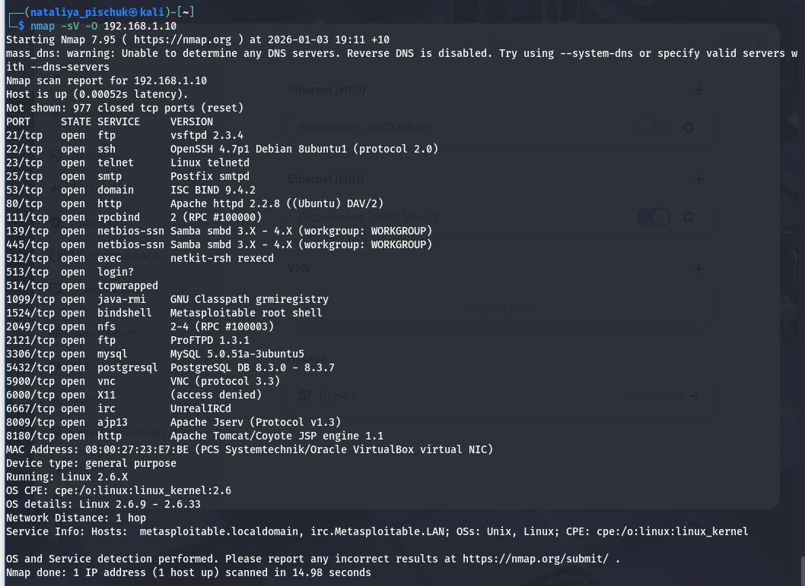
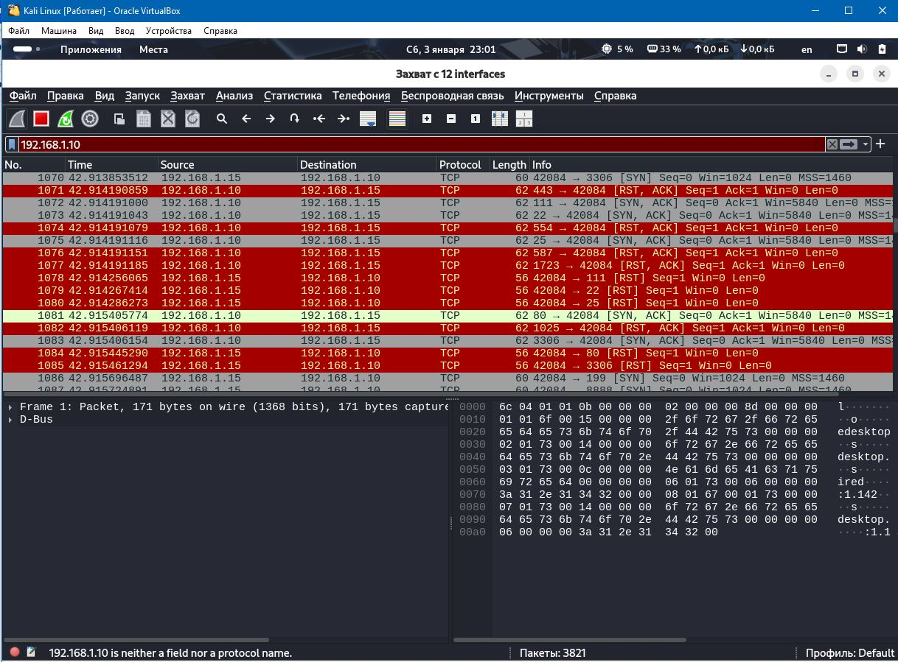
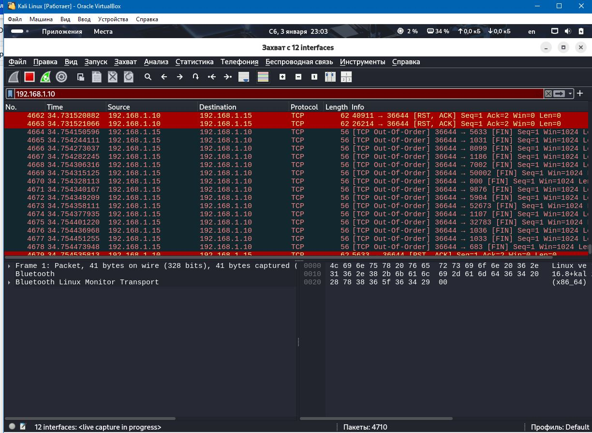
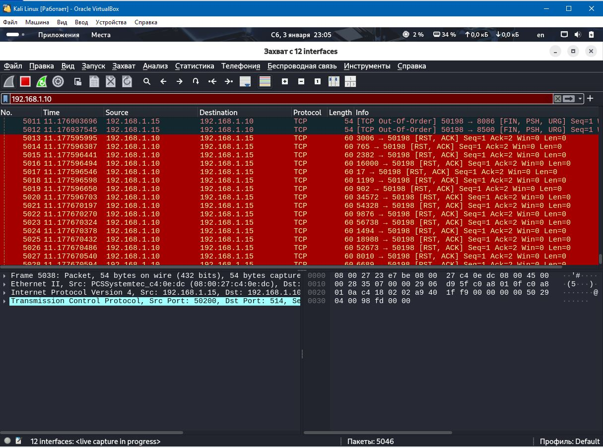
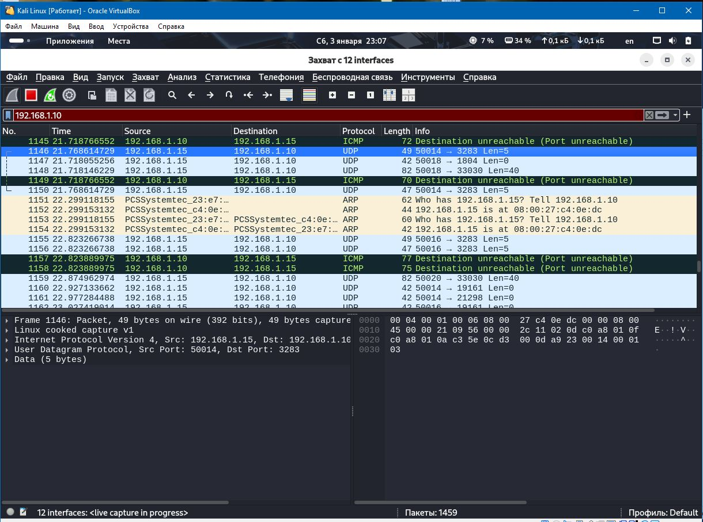

# Домашнее задание по занятию «Уязвимость и воздействие на системы»
## Задание 1
скачайте и установите виртуальную машину Metasploitable: https://sourceforge.net/projects/metasploitable/ .

Это типичная ОС для экспериментов в области информационной безопасности, с которой следует начать при анализе уязвимостей.

Просканируйте эту виртуальную машину с помощью nmap .

пытаемся найти уязвимости, в которых происходит эта виртуальная машина.

Сами уязвимости можно найти на сайте https://www.exploit-db.com/ .

Для этого нужно в поиске ввести название сетевой службы, обнаруженной на атакуемой машине, и выбрать подходящие по версии уязвимости.

Ответьте на следующие вопросы:

Какие сетевые службы в ней разрешены?
Какие уязвимости обнаружены вами? (список со ссылками: достаточно трёх уязвимостей)
Примите ответ в свободной форме.

## Ответ 
Развернула две виртуальные машины metasploitable и kali и настроила их.

### Результат сканирования  ВМ с Metasploitable

Уязвимости

https://www.exploit-db.com/exploits/49757 — Выполнение команд через бэкдор

https://www.exploit-db.com/exploits/6122 — Отравление кэша DNS на удаленном уровне (Metasploit)

https://www.exploit-db.com/exploits/41974 - RPCBind / libtirpc — отказ в обслуживании

## Задание 2
Проведите сканирование Metasploitable в режимах SYN, FIN, Xmas, UDP.
Запишите сеансы сканирования в Wireshark.

## Ответ
Чем отличаются эти режимы сканирования с точки зрения сетевого трафика?

#### SYN-сканирование

    nmap -sS 192.168.1.10

- Если порт открыт, сервер отвечает SYN-ACK.
- Если порт закрыт, сервер отвечает RST.
- Если порт фильтруется, ответа может не быть.

#### FIN-сканирование

    nmap -sF 192.168.1.10

- Если порт закрыт, сервер отвечает кодом RST.
- Если порт открыт или фильтруется, ответа не будет.

Это сканирование может обходить некоторые фильтры и брандмауэры.

#### Xmas-сканирование
    nmap -sX 192.168.1.10

- Если порт закрыт, сервер отвечает кодом RST.
- Если порт открыт или фильтруется, ответа не будет.

#### UDP-сканирование
    nmap -sU 192.168.1.10

- Если порт открыт, ответа может не быть или будет специфический ответ приложения.
- Если порт закрыт, сервер отвечает ICMP-пакетом «порт недоступен».
- Если порт фильтруется, ответа может не быть.

### Как отвечает сервер?
- При сканировании UDP — ICMP-пакеты с ошибками в коде (порт закрыт) или пакетом UDP (порт открыт). Нет ответа - вероятно, порт открыт
- SYN-сканирование - TCP [SYN, ACK] (порт открыт) [RST, ACK], [RST] (порт закрыт) пакеты
- FIN сканирования - TCP [RST, ACK] пакеты (порт закрыт)
- Xmas сканирование - пакеты TCP [RST, ACK] (порт закрыт)
